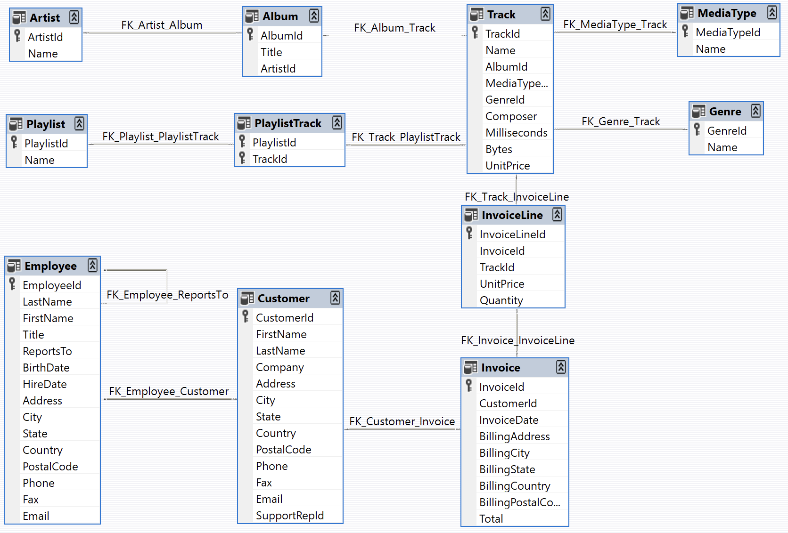

# naturalSQLBot
This bot takes a user input in natural language and converts it into a sql query and runs that query on a mysql server and returns a response in natural language

Data set used is a sample database that represents a digital media store, including tables for artists, albums, media tracks, invoices, and customers. We will use this database to test our chatbot. Here is the link to the database download page.

https://github.com/lerocha/chinook-database/blob/master/ChinookDatabase/DataSources/Chinook_MySql.sql

Data Model

